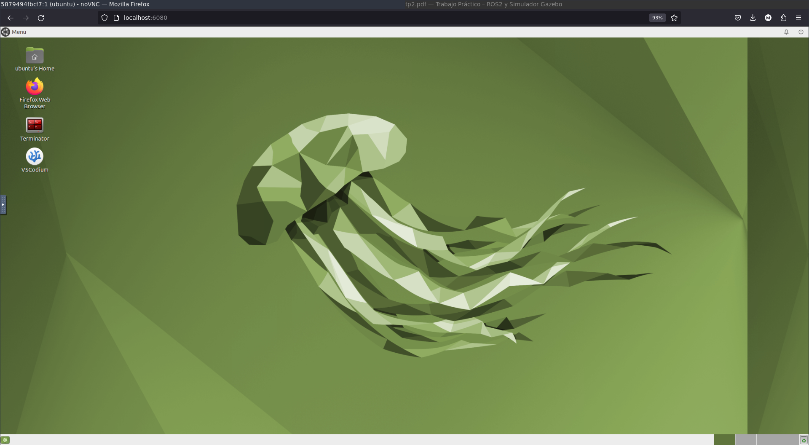
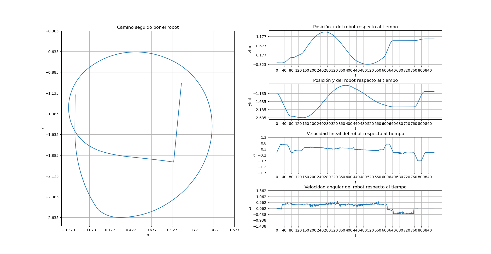
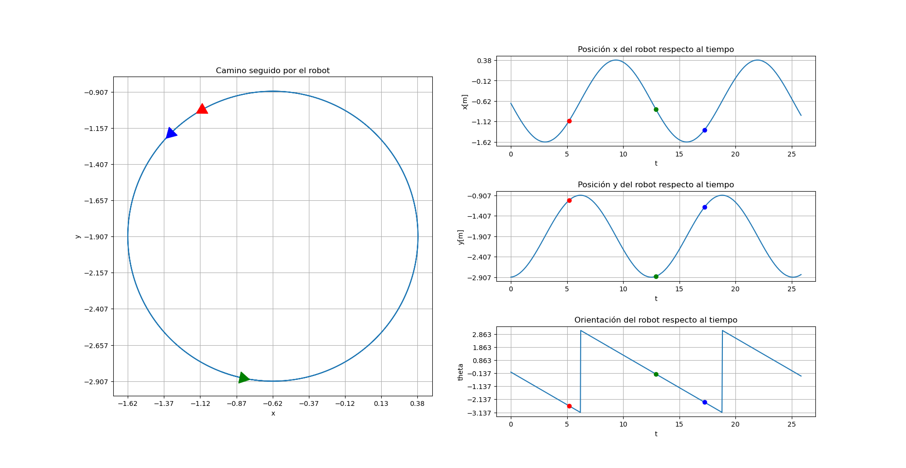
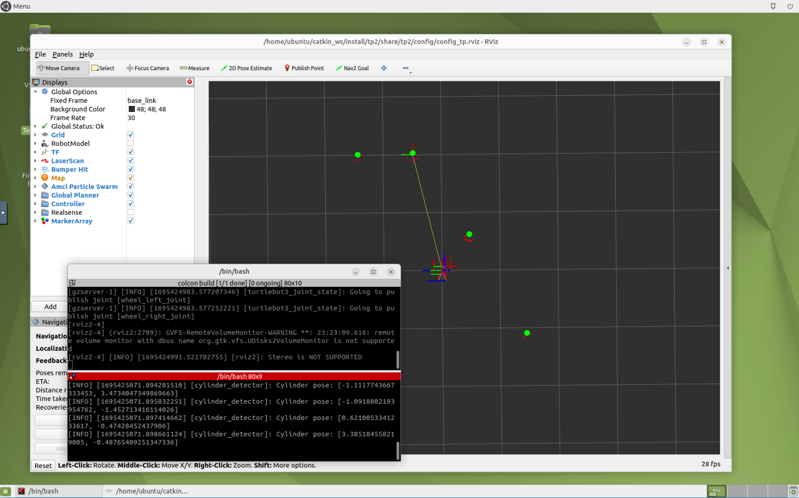

# ROS2 + Gazebo

ROS2 y Simulador Gazebo configurado en entorno docker-compose + NoVNC. Permite usar un escritorio a través del navegador web. Sin aceleración de GPU 


## Dependencias
- [Docker](https://docs.docker.com/engine/install/ubuntu/)
- [Docker-compose](https://docs.docker.com/compose/install/)


## Pasos para ejecutar el contenedor
```bash
cd path/to/this/repo
docker-compose build
docker-compose up
```

## Pasos para acceder al escritorio
En un navegador web ir a la dirección [http://localhost:6080/](http://localhost:6080/) se debería ver una página como la siguiente (o presionar *Conectar*):


Aquí se puede ejecutar programas normalmente como en un entorno de escritorio normal. Para abrir una terminal se puede usar el atajo de teclado `Ctrl + Alt + T` o hacer click en el icono de terminator en el escritorio.

## Pasos para realizar pruebas
El contenedor monta el directorio `./tp2` en el directorio `/home/catkin_ws/src` del contenedor. Por lo que se puede desarrollar normalmente en el directorio `./tp2` y los cambios se verán reflejados en el contenedor. Puede editar los archivos dentro de `./tp2` con su editor de texto favorito.

Para todas las pruebas acontinuación, se utilizará la terinal `Terminator` que se encuentra en el escritorio.
### Ejercicio 4
Para obtener el registro (log) de odometría del robot, se debe ejecutar el siguiente comando en una terminal del contenedor:
```bash
# Lanzar la simulación (si no se carga la configuracinón de Rviz, recargarla manualmente):
ros2 launch tp2 tb3_simulation_launch
# En una nueva terminal (se puede dividir en horizontal la terminal actual) ejecutar:
ros2 run tp2 dump_odom
```
Por la pantalla se mostrará el log de odometría del robot. Para detener el programa presionar `Ctrl + C` en la terminal donde se ejecutó el programa. La salida del programa en la segunda terminal se debería ver como:
```bash
120.721	-1.9096506345009463	-3.203430669197587	2.8272882397574386	-0.5065613988181882	0.51464763260618
120.755	-1.8932947792448958	-3.208579777912561	2.844845247490869	-0.5063759630885409	0.5109374524557049
120.789	-1.8768127625957114	-3.2134710518971983	2.8620651599165385	-0.5085950547485307	0.4905038667489773
120.823	-1.860122008628044	-3.2179968627450632	2.878408294146366	-0.5077207304548079	0.4796668725960024
120.857	-1.843350477791219	-3.222450819414345	2.8947287241786186	-0.5111678476848345	0.47958592617506135
120.891	-1.8264798768274257	-3.2269324988328565	2.911053550885588	-0.5138540366127501	0.47951911458822777
120.925	-1.8095186182749505	-3.231440469349354	2.92737639998529	-0.5162612868170676	0.479452949103016
120.959	-1.7924690107233205	-3.2359715447986623	2.9436917213477107	-0.5184770470205989	0.47938728528652585
120.993	-1.7753306111745484	-3.2405230736453072	2.9599954960102046	-0.5205831895745671	0.47932313400783355
121.027	-1.7581002575692921	-3.2450928295390913	2.976286705009488	-0.5226622388393677	0.4792614108749484
```

### Ejercicio 5
Para generar las gráficas a partir de los archivos log del ejercicio 5, se debe ejecutar el siguiente comando en una terminal FUERA del contenedor (en la máquina local):
```bash
cd path/to/this/repo
cd scripts
python3 plot_ej5.py
```
El script muestra la trayectoria del robot en el plano XY, la posición x, y, del robot en función del tiempo y la velocidad lineal y angular del robot en función del tiempo. Se debería abrir una imagen como la siguiente:


### Ejercicio 7
Para generar las gráficas a partir de los archivos log del ejercicio 6, se debe ejecutar el siguiente comando en una terminal FUERA del contenedor (en la máquina local):
```bash
cd path/to/this/repo
cd scripts
python3 plot_ej7.py ../tp2/logs/log_ej7_np.txt
```
En la carpeta logs se encuentran los archivos log de las pruebas realizadas. Las últimas dos letras del nombre del archivo corresponden al signo de velocidad lineal y angular del robot. Para todas las pruebas se utilizó una velocidad lineal de 0.5 m/s y una velocidad angular de 0.5 rad/s. Se debería abrir una imagen como la siguiente:
 

Para ejecutar el controlador de posición del ejercicio 7, se debe ejecutar el siguiente comando en una terminal del contenedor:
```bash
# Lanzar la simulación (si no se carga la configuracinón de Rviz, recargarla manualmente):
ros2 launch tp2 tb3_simulation_launch
# En una nueva terminal (se puede dividir en horizontal la terminal actual) ejecutar:
ros2 run tp2 ejer7
```
El robot debería desplaarse en linea recta y luego girar en sentido anti horario. Para detener el programa presionar `Ctrl + C` en la terminal donde se ejecutó el programa.

### Ejercicio 8
Para ejecutar el algoritmo de deteccin ón de cilindros del ejercicio 8, se debe ejecutar el siguiente comando en una terminal del contenedor:
```bash
# Lanzar la simulación (si no se carga la configuracinón de Rviz, recargarla manualmente):
ros2 launch tp2 tb3_simulation_launch
# En una nueva terminal (se puede dividir en horizontal la terminal actual) ejecutar:
ros2 run tp2 ej8
```
En la ventana de rviz, configura el frame de referencia a `base_footprint` y agregar un tópico de tipo marker llamado `cylinders`. Se deberían ver cilindros de color verde en la simulación, los cuales corresponden a los obstáculos detectados en gazebo.


## Pasos para detener el contenedor
```bash
cd path/to/this/repo
docker-compose down
```